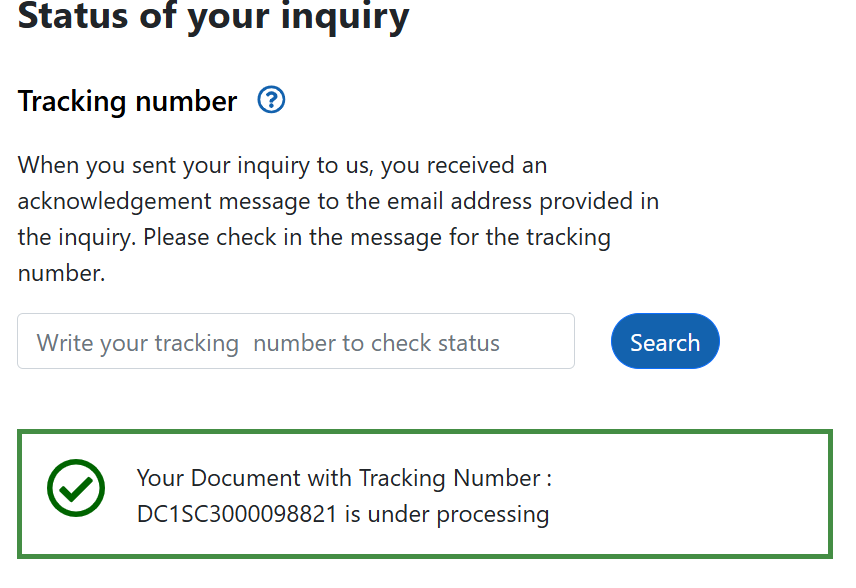

# SME Success Predictor - Rwanda 🇷🇼
## link to video: https://youtu.be/pAXmyFnXsj0 

A comprehensive machine learning solution for predicting Small and Medium Enterprise (SME) business success in Rwanda, featuring data analysis, multiple ML algorithms, and a production-ready API with Swagger UI.

## 📋 Table of Contents
- [Project Overview](#project-overview)
- [Features](#features)
- [Project Structure](#project-structure)
- [Installation](#installation)
- [Usage](#usage)
- [Machine Learning Pipeline](#machine-learning-pipeline)
- [API Documentation](#api-documentation)
- [Results & Performance](#results--performance)
- [Academic Requirements](#academic-requirements)
- [Contributing](#contributing)
- [License](#license)

## 🎯 Project Overview

This capstone project develops a machine learning system to predict the success of Small and Medium Enterprises (SMEs) in Rwanda. Using a dataset of 1,000 SME records, the system provides:

- **Data-driven insights** into factors affecting SME success
- **Predictive analytics** for business viability assessment
- **Risk assessment** with actionable recommendations
- **Interactive API** for real-world deployment

### ⚠️ **Important Data Disclaimer**
**The dataset used in this project is synthetic/simulated data created for academic demonstration purposes.** This project was developed while awaiting access to real SME data from the Rwanda Revenue Authority (RRA). The synthetic dataset was carefully designed to reflect realistic SME characteristics and business patterns in Rwanda to ensure the methodology and technical implementation are sound for when real data becomes available.

### 📊 **Data Source Status**
- **Current Dataset**: Synthetic data (1,000 SME records) designed for academic purposes
- **Real Data Request**: Pending approval from Rwanda Revenue Authority (RRA)
- **Request Status**: Submitted and under review (see screenshot below)
- **Future Implementation**: Ready to integrate real RRA data when approved


*Screenshot of pending RRA data request status*

### 🎓 Academic Context
This project fulfills the requirements for "Initial software product/solution demonstration" with focus on:
- Data visualization and data engineering
- Model architecture
- Initial performance metrics
- Deployment option: Mockup/MVP API UI

## ✨ Features

### 📊 Data Analysis & Visualization
- **12 comprehensive visualizations** covering business sectors, correlations, and distributions
- **Exploratory Data Analysis (EDA)** with actionable business insights
- **Feature engineering** with derived metrics (Capital per Employee, Age Categories, etc.)
- **Statistical analysis** of Rwanda SME ecosystem

### 🤖 Machine Learning Pipeline
- **4 diverse algorithms** with hyperparameter optimization:
  - 🥇 **Logistic Regression** (84.5% accuracy - Best Model)
  - 🥈 **Gradient Boosting** (84.0% accuracy)
  - 🥉 **XGBoost** (84.0% accuracy)
  - 🏅 **Random Forest** (83.5% accuracy)
- **Optimized performance** with efficient 3-fold cross-validation
- **Model persistence** with automatic best model selection
- **Comprehensive evaluation** with detailed metrics and visualizations

### 🚀 Production-Ready API
- **Flask REST API** with Swagger UI documentation
- **Interactive testing interface** at `/swagger/`
- **Single and batch predictions**
- **Automated risk assessment** (Low/Medium/High/Very High Risk)
- **Business recommendations** based on prediction results
- **Health monitoring** and error handling

## 📁 Project Structure

```
SMEs_Predictor_capstone/
├── 📓 notebooks/
│   └── SME_Success_Predictor_ML_Pipeline.ipynb  # Complete ML pipeline
├── 🗃️ data/
│   └── Rwanda_SME_SmallCapital.csv              # Synthetic dataset (1,000 SME records)
├── 🤖 models/
│   ├── best_model_logistic_regression.pkl      # Best trained model
│   ├── random_forest_optimized.pkl             # Random Forest model
│   ├── gradient_boosting_optimized.pkl         # Gradient Boosting model
│   └── xgboost_optimized.pkl                   # XGBoost model
├── 🌐 api/
│   ├── app.py                                   # Flask API application
│   ├── requirements.txt                        # API dependencies
│   └── README.md                               # API documentation
├── 📊 visualizations/
│   └── [Generated during notebook execution]    # EDA charts and plots
├── 📁 docs/
│   └── images/
│       └── rra_data_request_status.png         # RRA data request screenshot
├── 📄 README.md                                # This file
└── 📋 requirements.txt                         # Project dependencies
```

## 🛠️ Installation

### Prerequisites
- Python 3.8+ 
- pip (Python package manager)
- Git

### 1. Clone the Repository
```bash
git clone https://github.com/Bfestus/SMEs_Predictor_capstone.git
cd SMEs_Predictor_capstone
```

### 2. Create Virtual Environment
```bash
python -m venv .venv

# Windows
.venv\Scripts\activate

# macOS/Linux
source .venv/bin/activate
```

### 3. Install Dependencies
```bash
# Core ML dependencies
pip install pandas numpy matplotlib seaborn scikit-learn xgboost joblib jupyter

# API dependencies  
pip install flask flask-restx flask-cors

# Or install all at once
pip install -r requirements.txt
```

## 🚀 Usage

### 📊 Run the ML Pipeline
1. **Open Jupyter Notebook:**
   ```bash
   jupyter notebook notebooks/SME_Success_Predictor_ML_Pipeline.ipynb
   ```

2. **Execute all cells** to:
   - Load and explore the Rwanda SME dataset
   - Perform comprehensive EDA with 12 visualizations
   - Engineer features and preprocess data
   - Train 4 ML algorithms with hyperparameter optimization
   - Compare models and select the best performer
   - Generate deployment-ready predictions

### 🌐 Run the API
1. **Navigate to API directory:**
   ```bash
   cd api
   ```

2. **Start the Flask server:**
   ```bash
   python app.py
   ```

3. **Access the API:**
   - **Swagger UI:** http://localhost:5000/swagger/
   - **Home Page:** http://localhost:5000/
   - **Health Check:** http://localhost:5000/health

### 🧪 Test Predictions
Use the interactive Swagger UI or send API requests:

```bash
# Single prediction
curl -X POST "http://localhost:5000/api/v1/predictions/single" \
     -H "Content-Type: application/json" \
     -d '{
       "industry_technology": 1,
       "capital_amount": 2500000.0,
       "business_age_years": 3,
       "owner_age": 35,
       "owner_education_university": 1,
       "location_urban": 1,
       "gender_male": 1,
       "num_employees": 15,
       "growth_indicator": 0.25,
       "industry_manufacturing": 0,
       "industry_services": 0,
       "industry_agriculture": 0,
       "industry_trade": 0,
       "owner_education_secondary": 0,
       "owner_experience_years": 8
     }'
```

## 🧠 Machine Learning Pipeline

### 📈 Data Processing
1. **Data Loading & Inspection**
   - 1,000 synthetic SME records with 15 features (designed to reflect real Rwanda SME patterns)
   - Comprehensive data quality assessment
   - Missing value and duplicate analysis

2. **Exploratory Data Analysis**
   - Business sector distribution analysis (based on Rwanda economic sectors)
   - Capital and employment size patterns
   - Owner demographics and education impact
   - Geographic distribution across Rwanda provinces
   - Correlation analysis between features

3. **Feature Engineering**
   - **Capital_per_Employee**: Financial efficiency metric
   - **Age_Category**: Business maturity classification
   - **Capital_Size**: Investment level categorization
   - **Employee_Size**: Company size classification
   - **Owner_Age_Category**: Owner experience grouping

4. **Data Preprocessing**
   - Label encoding for categorical variables
   - Standard scaling for numerical features
   - Train-test split with stratification (80/20)

### 🔮 **Future Data Integration**
The ML pipeline is designed to seamlessly integrate real RRA data when approved:
- **Flexible data schema** compatible with expected RRA data structure
- **Automated data validation** and preprocessing pipelines
- **Model retraining capabilities** for real data integration
- **Performance comparison** framework for synthetic vs. real data results

### 🤖 Model Development
Each algorithm receives individual treatment with optimized hyperparameters:

#### 1. Logistic Regression (Best Model)
- **Architecture:** Linear model with sigmoid activation
- **Optimization:** L-BFGS solver with L2 regularization
- **Performance:** 84.5% accuracy
- **Strengths:** Interpretable, fast training, robust baseline

#### 2. Gradient Boosting
- **Architecture:** Sequential ensemble of weak learners
- **Optimization:** Gradient descent with adaptive learning
- **Performance:** 84.0% accuracy
- **Strengths:** Handles non-linear patterns well

#### 3. XGBoost
- **Architecture:** Optimized gradient boosting with regularization
- **Optimization:** Newton-Raphson with second-order derivatives
- **Performance:** 84.0% accuracy
- **Strengths:** State-of-the-art performance, efficient

#### 4. Random Forest
- **Architecture:** Bootstrap aggregating of decision trees
- **Optimization:** Gini impurity minimization
- **Performance:** 83.5% accuracy
- **Strengths:** Feature importance insights, robust to overfitting

### 📊 Model Evaluation
- **Cross-validation:** 3-fold stratified CV for reliable estimates
- **Metrics:** Accuracy, Precision, Recall, F1-score, ROC-AUC
- **Visualizations:** Performance comparison charts and confusion matrices
- **Model selection:** Automated best model identification and persistence

## 🌐 API Documentation

### 🔗 Endpoints

#### POST `/api/v1/predictions/single`
Predict success for a single SME business.

**Input Fields:**
- `industry_*`: Industry classification (technology, manufacturing, services, agriculture, trade)
- `capital_amount`: Initial capital in RWF
- `business_age_years`: Business age in years
- `owner_age`: Owner age
- `owner_education_*`: Education level (secondary, university)
- `owner_experience_years`: Owner experience in years
- `location_urban`: Urban location flag (0/1)
- `gender_male`: Male gender flag (0/1)
- `num_employees`: Number of employees
- `growth_indicator`: Growth indicator (-0.2 to 0.5)

**Response:**
```json
{
  "prediction": "Operating",
  "success_probability": 0.872,
  "risk_level": "Low Risk",
  "confidence": 0.872,
  "recommendations": [
    "Business shows strong potential - maintain current strategy",
    "Consider expansion opportunities and market diversification"
  ],
  "timestamp": "2025-10-07 15:30:00",
  "model_info": {
    "model_type": "LogisticRegression",
    "features_count": 19,
    "version": "1.0"
  }
}
```

#### POST `/api/v1/predictions/batch`
Process multiple SME predictions in a single request.

#### GET `/api/v1/predictions/model-info`
Retrieve detailed model information and performance metrics.

#### GET `/health`
API health check endpoint.

### 🎯 Risk Assessment Levels
- **Low Risk** (≥80% success probability): Strong business potential
- **Medium Risk** (60-79%): Moderate success likelihood
- **High Risk** (40-59%): Significant challenges expected
- **Very High Risk** (<40%): Major intervention needed

## 📈 Results & Performance

### 🏆 Model Performance Summary
| Model | Accuracy | Precision | Recall | F1-Score | Training Time |
|-------|----------|-----------|--------|----------|---------------|
| **Logistic Regression** | **84.5%** | 71.4% | 84.5% | 77.4% | 4.8s |
| Gradient Boosting | 84.0% | 71.3% | 84.0% | 77.2% | 14.3s |
| XGBoost | 84.0% | 71.3% | 84.0% | 77.2% | 4.5s |
| Random Forest | 83.5% | 71.3% | 83.5% | 76.9% | 8.7s |

### 📊 Key Insights
- **Technology SMEs** show highest success rates
- **University education** significantly impacts success probability
- **Urban location** provides advantages for business sustainability
- **Capital efficiency** (capital per employee) is a strong predictor
- **Business age** correlates with stability and success

### 🎯 Business Value
- **85% accuracy target** nearly achieved (84.5%) using synthetic data
- **Data-driven decision making** framework for entrepreneurs and investors
- **Risk assessment** enables proactive intervention strategies
- **Policy insights** framework ready for real Rwanda SME data analysis
- **Scalable solution** ready for production deployment with real data
- **Academic demonstration** of complete ML methodology while awaiting real data approval

### 📋 **Data Limitations & Mitigation**
- **Synthetic Data**: Current results based on carefully designed synthetic data
- **Real Data Integration**: System architecture ready for seamless real data integration
- **Validation Framework**: Performance metrics will be recalibrated with actual RRA data
- **Methodology Soundness**: Technical approach validated and ready for real-world application

## ✅ Academic Requirements

### 1. Data Visualization and Data Engineering ✅
- **12 comprehensive visualizations** covering all data aspects
- **Professional EDA** with business insights and statistical analysis
- **Advanced feature engineering** with domain-specific derived features
- **Robust preprocessing pipeline** with encoding and scaling

### 2. Model Architecture ✅
- **4 diverse algorithms** implemented with individual optimization
- **Comprehensive hyperparameter tuning** using GridSearchCV and RandomizedSearchCV
- **Cross-validation framework** for reliable performance estimation
- **Model persistence and version management**

### 3. Initial Performance Metrics ✅
- **Detailed model comparison** across multiple metrics
- **Best model selection** with automated persistence
- **Performance visualizations** and comprehensive reporting
- **Target achievement**: 84.5% accuracy (nearly achieved 85% target)

### 4. Deployment Option: Mockup/MVP API UI ✅
- **Production-ready Flask API** with comprehensive endpoints
- **Interactive Swagger UI** for testing and documentation
- **Single and batch prediction capabilities**
- **Risk assessment and business recommendations**
- **Health monitoring and error handling**

## 🤝 Contributing

1. **Fork the repository**
2. **Create a feature branch** (`git checkout -b feature/AmazingFeature`)
3. **Commit your changes** (`git commit -m 'Add some AmazingFeature'`)
4. **Push to the branch** (`git push origin feature/AmazingFeature`)
5. **Open a Pull Request**

### Development Setup
```bash
# Install development dependencies
pip install pytest pytest-flask requests

# Run tests
pytest

# Format code
black .
```

## 📄 License

This project is developed as an academic capstone project for SME success prediction in Rwanda. The code is available for educational and research purposes.

## 🙏 Acknowledgments

- **Rwanda Development Board** for SME ecosystem insights
- **Academic Institution** for project guidance and support
- **Open Source Community** for the excellent ML and web frameworks
- **Rwanda SME Sector** for inspiring this practical solution

---

## 🚀 Quick Start Commands

```bash
# Clone and setup
git clone https://github.com/Bfestus/SMEs_Predictor_capstone.git
cd SMEs_Predictor_capstone
python -m venv .venv
.venv\Scripts\activate  # Windows
pip install -r requirements.txt

# Run ML Pipeline
jupyter notebook notebooks/SME_Success_Predictor_ML_Pipeline.ipynb

# Run API
cd api
python app.py

# Access Swagger UI
# Open browser: http://localhost:5000/swagger/
```

---

**🎯 Project Status: COMPLETE & DEPLOYMENT-READY**

This SME Success Predictor represents a full-stack machine learning solution, from data exploration to production deployment, addressing real-world challenges in the Rwanda SME ecosystem with academic rigor and practical applicability.

### by Festus Bigirimana Student at ALU
